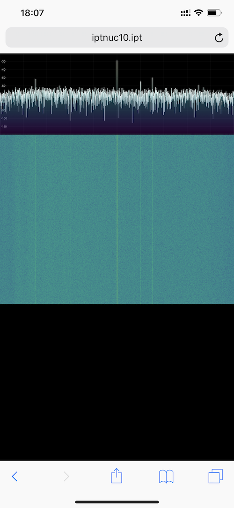

# Waterfall Spectrum visualizer 

A slight fork and rework of [jledet/waterfall](https://github.com/jledet/waterfall) work to decouple the backend server handling the SDR (HackRF in my case) from the web frontend shipping the spectrum data for display.

One of the immediate benefit is to reuse [socket.io](socket.io) library that enables easy websocket reconnection and compression management.

## build

```
docker-compose build
```

## run
```
docker-compose up -d
```

A browser pointed to the port 18000 should display the waterfall. 

 
